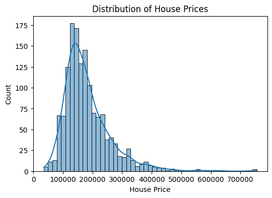

# 🏠 House Price Prediction (Machine Learning Project)

This project predicts house prices using machine learning regression techniques.
It is an end-to-end ML project covering data analysis, preprocessing, model training,
evaluation, and model persistence.

---

## 📌 Project Overview

The goal of this project is to build a reliable regression model that can predict
house prices based on various features such as location, size, and amenities.

The project follows a **real-world machine learning workflow**:
- Data exploration (EDA)
- Data preprocessing using pipelines
- Model training and evaluation
- Saving trained models for future use

---

## 🧠 Machine Learning Approach

- **Model:** Random Forest Regressor
- **Evaluation Metric:** RMSE (Root Mean Squared Error)
- **Achieved RMSE:** **~10,900**

---

## 🔧 Data Preprocessing

Data preprocessing is implemented using scikit-learn pipelines.

- Numeric features:
  - Missing values handled using median
  - Standard scaling applied
- Categorical features:
  - Missing values filled with "None"
  - One-hot encoding applied

All preprocessing steps are combined using a ColumnTransformer to ensure
consistent processing.

---

## 📊 Exploratory Data Analysis (EDA)

Exploratory data analysis was performed to understand the dataset structure,
missing values, and the distribution of house prices.

Example visualization:



---

## 🚀 How to Run the Project

1. Create and activate a virtual environment
```bash
python -m venv venv
venv\Scripts\Activate.ps1

pip install -r requirements.txt

python src/train.py
```

## 🟢 STEP 8 — Technologies section

Add this:

```md
---

## 🛠 Technologies Used

- Python
- Pandas, NumPy
- Matplotlib, Seaborn
- Scikit-learn
- Jupyter Notebook
- Git & GitHub

---

## 👤 Author

**Dulara Madusanka**  
ICT Undergraduate | Machine Learning Enthusiast